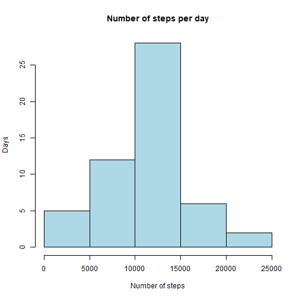
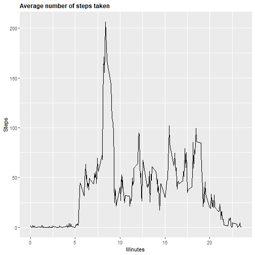
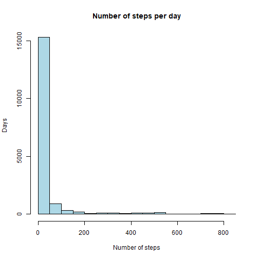

## 1. Loading and preprocessing the data

```r
## First import the data
Data <- read.csv("repdata_data_activity/activity.csv")

## Importing libraries for future usage
library(dplyr)
library(ggplot2)
```

Now we investigate the variables present in the dataset. As you can see, the data consists of 3 variables. The variables are: 

steps: Number of steps taking in a 5-minute interval (missing values are coded as \color{red}{\verb|NA|}NA)  
date: The date on which the measurement was taken in YYYY-MM-DD format  
interval: Identifier for the 5-minute interval in which measurement was taken


```r
str(Data)
```

```
## 'data.frame':	17568 obs. of  3 variables:
##  $ steps   : int  NA NA NA NA NA NA NA NA NA NA ...
##  $ date    : Factor w/ 61 levels "2012-10-01","2012-10-02",..: 1 1 1 1 1 1 1 1 1 1 ...
##  $ interval: int  0 5 10 15 20 25 30 35 40 45 ...
```


## 2. What is mean total number of steps taken per day?

2.1. Calculate the total number of steps taken per day


```r
Stepsperday <- aggregate(Data$steps, list(Data$date), FUN=sum)
colnames(Stepsperday) <- c("Date", "Steps")
Stepsperday
```

```
##          Date Steps
## 1  2012-10-01    NA
## 2  2012-10-02   126
## 3  2012-10-03 11352
## 4  2012-10-04 12116
## 5  2012-10-05 13294
## 6  2012-10-06 15420
## 7  2012-10-07 11015
## 8  2012-10-08    NA
## 9  2012-10-09 12811
## 10 2012-10-10  9900
## 11 2012-10-11 10304
## 12 2012-10-12 17382
## 13 2012-10-13 12426
## 14 2012-10-14 15098
## 15 2012-10-15 10139
## 16 2012-10-16 15084
## 17 2012-10-17 13452
## 18 2012-10-18 10056
## 19 2012-10-19 11829
## 20 2012-10-20 10395
## 21 2012-10-21  8821
## 22 2012-10-22 13460
## 23 2012-10-23  8918
## 24 2012-10-24  8355
## 25 2012-10-25  2492
## 26 2012-10-26  6778
## 27 2012-10-27 10119
## 28 2012-10-28 11458
## 29 2012-10-29  5018
## 30 2012-10-30  9819
## 31 2012-10-31 15414
## 32 2012-11-01    NA
## 33 2012-11-02 10600
## 34 2012-11-03 10571
## 35 2012-11-04    NA
## 36 2012-11-05 10439
## 37 2012-11-06  8334
## 38 2012-11-07 12883
## 39 2012-11-08  3219
## 40 2012-11-09    NA
## 41 2012-11-10    NA
## 42 2012-11-11 12608
## 43 2012-11-12 10765
## 44 2012-11-13  7336
## 45 2012-11-14    NA
## 46 2012-11-15    41
## 47 2012-11-16  5441
## 48 2012-11-17 14339
## 49 2012-11-18 15110
## 50 2012-11-19  8841
## 51 2012-11-20  4472
## 52 2012-11-21 12787
## 53 2012-11-22 20427
## 54 2012-11-23 21194
## 55 2012-11-24 14478
## 56 2012-11-25 11834
## 57 2012-11-26 11162
## 58 2012-11-27 13646
## 59 2012-11-28 10183
## 60 2012-11-29  7047
## 61 2012-11-30    NA
```

2.2 Make a histogram of the total number of steps taken each day


```r
hist(Stepsperday$Steps,
     main = "Number of steps per day",
     xlab = "Number of steps", 
     ylab = "Days", 
     border = "Black", 
     col= "Lightblue")
```



2.3. Calculate and report the mean and median of the total number of steps taken per day


```r
# Calculate the mean
mean(Stepsperday$Steps, na.rm=TRUE)
```

```
## [1] 10766.19
```

```r
# Calculate th emedian
median(Stepsperday$Steps, na.rm=TRUE)
```

```
## [1] 10765
```

## 3. What is the average daily activity pattern?

3.1. Make a time series plot (i.e. \color{red}{\verb|type = "l"|}type="l") of the 5-minute interval (x-axis) and the average number of steps taken, averaged across all days (y-axis)


```r
# create table with steps per time
Stepspertime <- aggregate(steps~interval, data=Data, FUN=mean, na.action=na.omit)

# variable time (more comprensible for the graph axis)

Stepspertime$time <- Stepspertime$interval/100

# draw the line plot

A <- ggplot(Stepspertime, aes(time, steps))

A + geom_line(col="Black")+ggtitle("Average number of steps taken")+xlab("Minutes")+ylab("Steps")+theme(plot.title = element_text(face="bold", size=12))
```




3.2 Which 5-minute interval, on average across all the days in the dataset, contains the maximum number of steps?
Answer: The 8.35 minute interval

```r
# Create dataframe
df1 <- data.frame(Stepspertime)


# Filter on dataframe columns time and steps with the maximum number of steps
df1 %>% select(time, steps) %>% filter(steps==max(df1$steps))
```

```
##   time    steps
## 1 8.35 206.1698
```

## Imputing missing values

Note that there are a number of days/intervals where there are missing values (coded as \color{red}{\verb|NA|}NA). The presence of missing days may introduce bias into some calculations or summaries of the data.  

4.1 Calculate and report the total number of missing values in the dataset (i.e. the total number of rows with \color{red}{\verb|NA|}NAs)
Answer: 2304

```r
# Create data frame for the original dataset
df <- data.frame(Data)

# Filter on dataframe for number of missing values, and then summarize the total number. 
df %>% filter(is.na(steps)) %>% summarize(missing_values = n())
```

```
##   missing_values
## 1           2304
```

4.2 Devise a strategy for filling in all of the missing values in the dataset. The strategy does not need to be sophisticated. For example, you could use the mean/median for that day, or the mean for that 5-minute interval, etc.


```r
# First we create a new dataset based on the original data frame. This is immediately the answer for question 4.3 
Newdata <- df

# Then we simply change all NA values to 1
Newdata[is.na(Newdata)] <- 1
```

4.3 Create a new dataset that is equal to the original dataset but with the missing data filled in.


```r
# Refrence is made to the above question. We first copy the original dataset. And then after copy we replace all NA velues with 1. 
Newdata <- df
Newdata[is.na(Newdata)] <- 1
```


4.4 Make a histogram of the total number of steps taken each day and Calculate and report the mean and median total number of steps taken per day. Do these values differ from the estimates from the first part of the assignment? What is the impact of imputing missing data on the estimates of the total daily number of steps?  


4.4.1 New histogram based on replacement of data. 

```r
hist(Newdata$steps,
     main = "Number of steps per day",
     xlab = "Number of steps", 
     ylab = "Days", 
     border = "Black", 
     col= "Lightblue")
```




4.4.2 Repport the mean and mediun total number of steps taken per day.Do these values differ from the estimates from the first part of the assignment?  

Answer: yes, very much. The mean is 32.61111 compared to 10766.19 earlier. the median is 0 compared to 10765 earlier. This is caused by the huge amount of NA values that were replaced by 1. Also take a look at the histogram, where the majority of the steps taken per day is now 1. 


```r
# Calculate the mean
mean(Newdata$steps, na.rm=TRUE)
```

```
## [1] 32.61111
```

```r
# Calculate the median
median(Newdata$steps, na.rm=TRUE)
```

```
## [1] 0
```

## Are there differences in activity patterns between weekdays and weekends?

5.1 Create a new factor variable in the dataset with two levels – “weekday” and “weekend” indicating whether a given date is a weekday or weekend day.


```r
# Create variable with date
Newdata$date <- as.Date(Newdata$date, format = "%Y-%m-%d")

# create a new variable for weekdays
Newdata$weekday <- weekdays(Newdata$date)

# create a new variable indicating weekday or weekend
Newdata$Daytype <- ifelse(Newdata$weekday=='Saturday' | Newdata$weekday=='Sunday', 'weekend','weekday')

# see first 10 values
head(Newdata, n=10)
```

```
##    steps       date interval weekday Daytype
## 1      1 2012-10-01        0  Monday weekday
## 2      1 2012-10-01        5  Monday weekday
## 3      1 2012-10-01       10  Monday weekday
## 4      1 2012-10-01       15  Monday weekday
## 5      1 2012-10-01       20  Monday weekday
## 6      1 2012-10-01       25  Monday weekday
## 7      1 2012-10-01       30  Monday weekday
## 8      1 2012-10-01       35  Monday weekday
## 9      1 2012-10-01       40  Monday weekday
## 10     1 2012-10-01       45  Monday weekday
```

5.2 Make a panel plot containing a time series plot (i.e. \color{red}{\verb|type = "l"|}type="l") of the 5-minute interval (x-axis) and the average number of steps taken, averaged across all weekday days or weekend days (y-axis). 
Answer: I am not succeeding in this question. 

